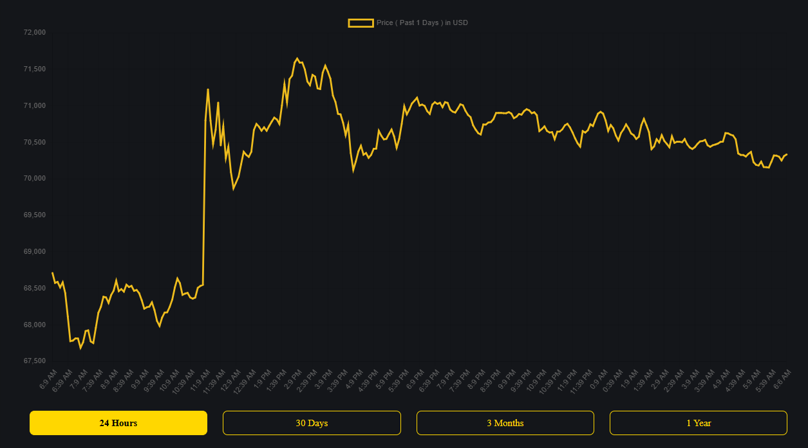

# Fullstack Developer Technical Assessment

## How to Run

```
git clone https://github.com/cyriontrade/cyriontrade-fullstack.git
cd server && npm install && npm run dev
cd ../client && npm install && npm start
```

Open [http://localhost:3000](http://localhost:3000)

---

## Chart Integration Task

### Overview

Technical assessment for senior fullstack developers. Replace the existing Chart.js implementation with TradingView Lightweight Charts and implement advanced interactive features.



---

## Objective

Migrate from Chart.js to TradingView Lightweight Charts and add interactive charting features that demonstrate senior-level expertise.

---

## Requirements

### 1. Chart Library Integration

Replace Chart.js with TradingView Lightweight Charts and implement multiple chart visualization types.

### 2. Interactive Features

Add interactive capabilities including tooltips, zoom, pan, and technical indicators.

### 3. User Interface

Build an intuitive control panel with chart controls, fullscreen mode, and export functionality.

### 4. Performance and Optimization

Ensure smooth performance with efficient data handling and proper state management using custom hooks.

---

## Deliverables

- Updated chart implementation
- Custom hooks
- Brief documentation (300-500 words)
- Screenshots and demo video

---

## Evaluation

| Area | Weight |
|------|--------|
| Code Quality & Architecture | 30% |
| Feature Implementation | 30% |
| Performance | 20% |
| User Experience | 10% |
| Unit Testing | 10% |

---

## Submission

Create branch `feature/tradingview-chart` and submit a pull request with implementation summary, screenshots, and documentation.

---

## Success Criteria

Deliver a production-quality chart implementation that demonstrates senior-level skills in architecture, performance optimization, and user experience design.

---


_Maintained by [Cyriontrade LLC](https://cyriontrade.com)_
