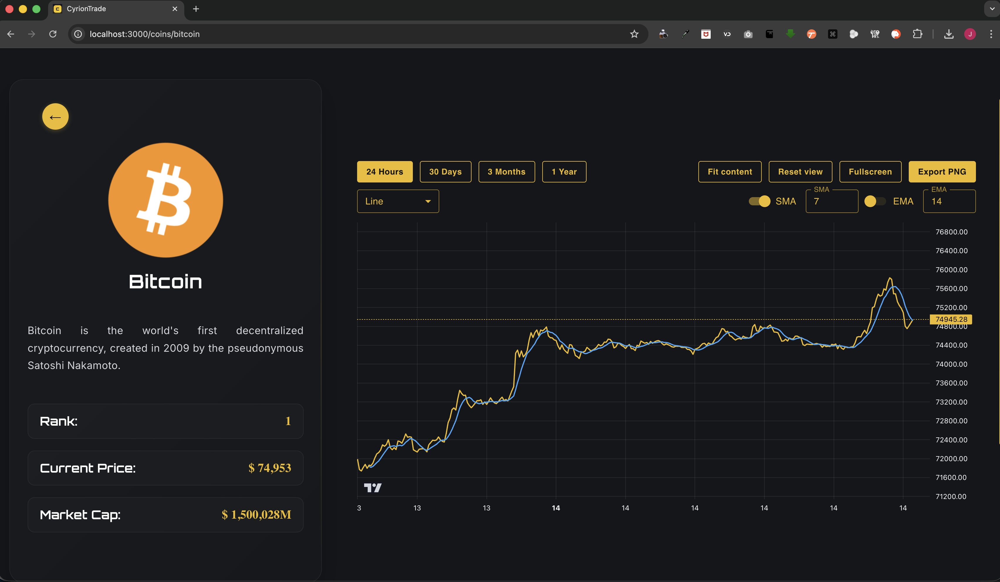
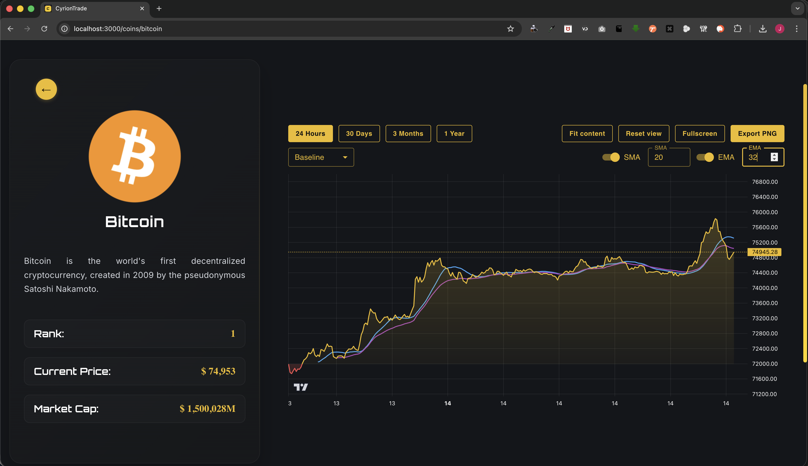
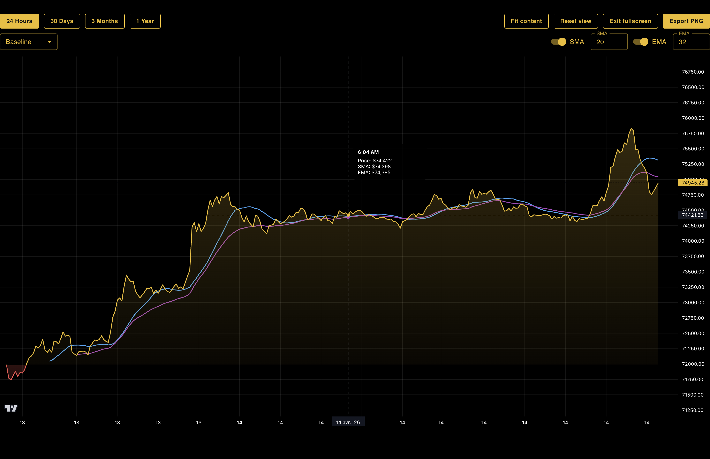
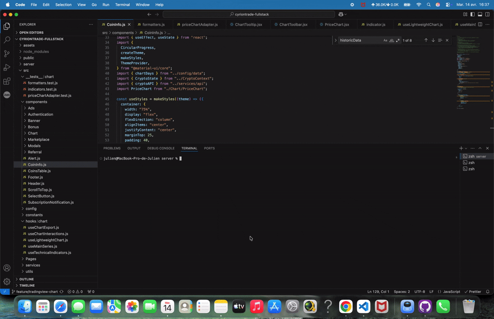
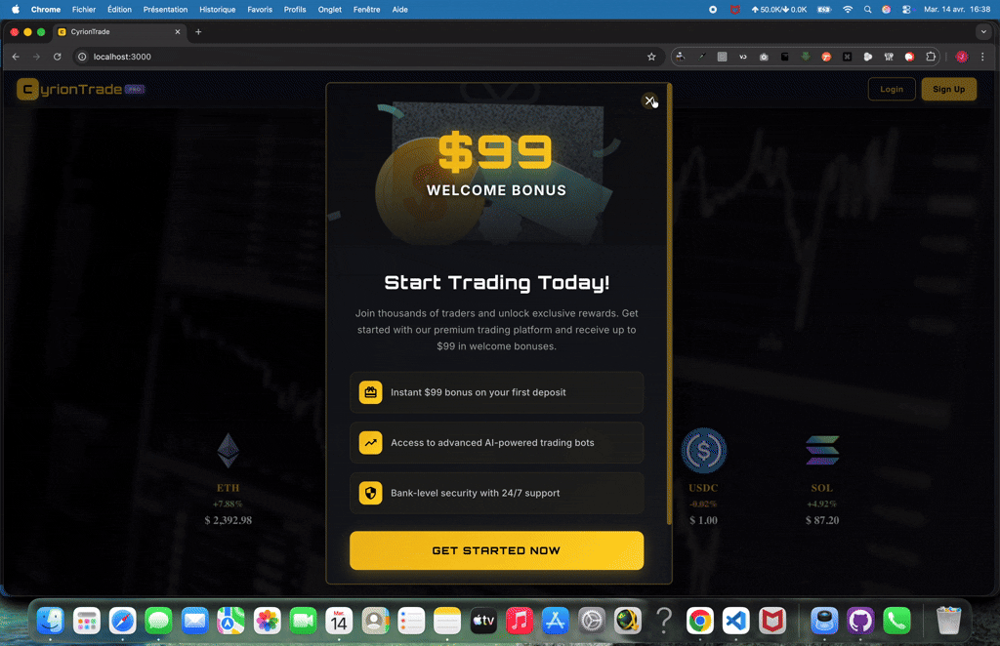
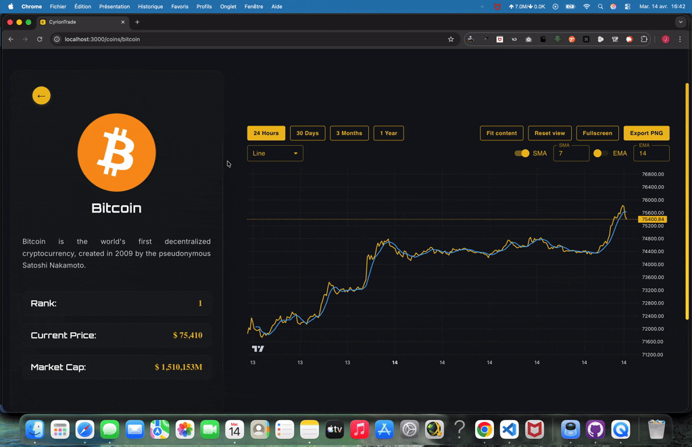
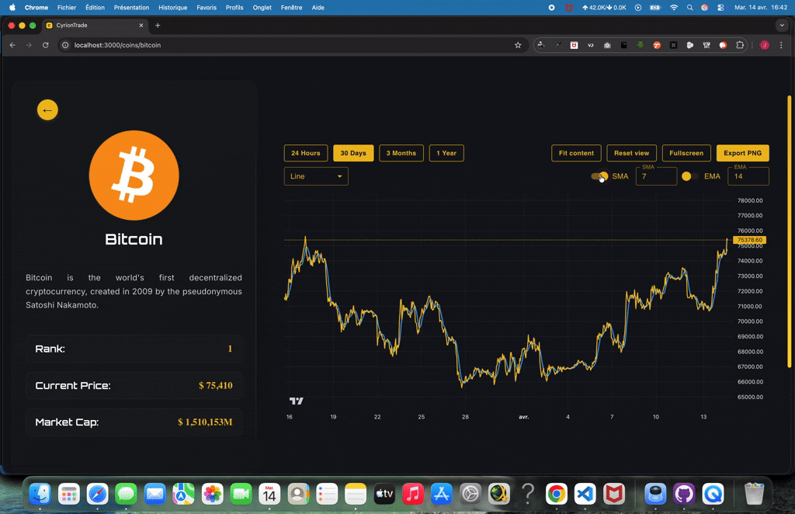
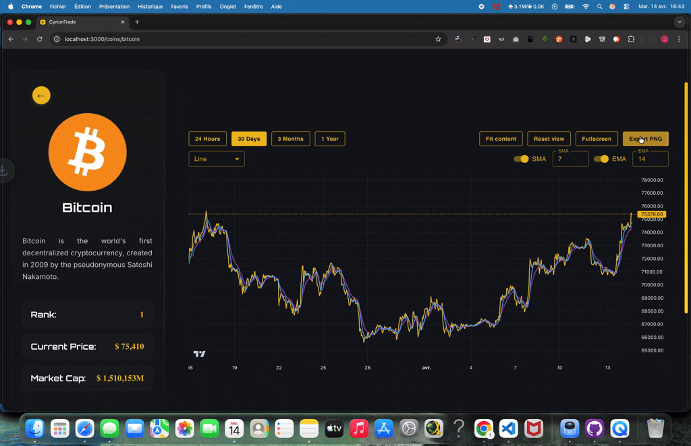

# Chart Integration Task

## Overview

This technical assessment focused on replacing the existing Chart.js implementation with TradingView Lightweight Charts and delivering a more advanced, production-oriented charting experience.

The implementation was approached as a frontend architecture and interaction refactor, not just a library swap. The goal was to improve chart rendering, user interaction, maintainability, and separation of concerns while keeping the existing data flow intact.

## Objective

Migrate from Chart.js to TradingView Lightweight Charts and add interactive charting features that demonstrate senior-level expertise.

## What Was Implemented

### 1. Chart Library Integration

The original `react-chartjs-2` line chart was replaced with a dedicated `PriceChart` component based on TradingView Lightweight Charts.

Implemented chart visualization types:
- Line
- Area
- Baseline

> Note: the current historical endpoint returns `prices` as `[timestamp, price]` tuples only.  
> Because no OHLC or volume dataset is currently provided by the API, the implementation focuses on the chart types that are fully supported by the available data shape.

### 2. Interactive Features

The new chart now includes:
- Custom HTML tooltip
- Zoom and pan
- SMA overlay
- EMA overlay
- Crosshair-driven multi-series tooltip values
- Responsive resizing
- Fullscreen mode
- PNG export

### 3. User Interface

A new chart toolbar was introduced to centralize all controls:
- time range selection
- chart type selection
- SMA / EMA toggles and periods
- fit content
- reset view
- fullscreen
- export PNG

The toolbar was also styled to match the existing product palette and integrated directly above the chart for a more cohesive UX.

### 4. Performance and Optimization

The implementation was structured around custom hooks to keep responsibilities isolated:
- `useLightweightChart` → chart lifecycle and resize handling
- `useMainSeries` → main series creation/recreation
- `useTechnicalIndicators` → derived SMA / EMA datasets
- `useChartInteractions` → tooltip, fullscreen, fit/reset actions
- `useChartExport` → PNG export workflow

Additional performance-oriented decisions:
- normalized chart data is memoized
- technical indicators are memoized
- chart and series instances are stored in refs
- resize is managed explicitly with `ResizeObserver` + `requestAnimationFrame`

## Architecture Summary

The original `CoinInfo` component was refactored to focus on:
- fetching historical data
- owning the selected range state
- passing chart inputs to the dedicated chart component

All chart-specific rendering and interaction logic now lives in `PriceChart` and related hooks. This improves:
- separation of concerns
- testability
- maintainability
- extensibility

## Unit Testing

Unit tests were added around the most valuable logic layers:
- data normalization
- time and price formatting
- SMA / EMA calculations
- indicator derivation behavior

The goal was to validate application logic and integration contracts, rather than testing the third-party chart library itself.

## Deliverables Included

- Updated chart implementation
- Custom hooks
- Brief inline code documentation
- Unit tests
- README documentation
- Screenshots and demo videos

## Known Limitation

The backend currently exposes only single-value price history (`prices`).  
Because of this, the implementation does not include candlestick or volume histogram rendering yet.

If OHLC / volume data is added later, the current architecture is ready to be extended with:
- candlestick series
- histogram volume series
- richer financial overlays

## Evaluation Alignment

| Area | Notes |
|------|-------|
| Code Quality & Architecture | Chart lifecycle, interactions, export, and indicators were split into dedicated hooks |
| Feature Implementation | Multiple chart types, tooltip, zoom/pan, fullscreen, export, SMA, EMA |
| Performance | Memoized derived data, ref-based chart instances, explicit resize strategy |
| User Experience | Unified toolbar, integrated range controls, improved visual consistency |
| Unit Testing | Utility and interaction-focused coverage added |

## Submission

Create branch `feature/tradingview-chart` and submit a pull request with:
- implementation summary
- this documentation

### screenshots
#### First options

#### More features

#### Fullsreen

### demo videos (one video in 5 pieces)
#### Part one

#### Part two

#### Part three

#### Part four

#### Part five

## Success Criteria

The final implementation aims to demonstrate senior-level frontend engineering through:
- clear separation of concerns
- robust chart lifecycle management
- pragmatic handling of current API constraints
- improved interactivity and usability
- maintainable and testable code organization
